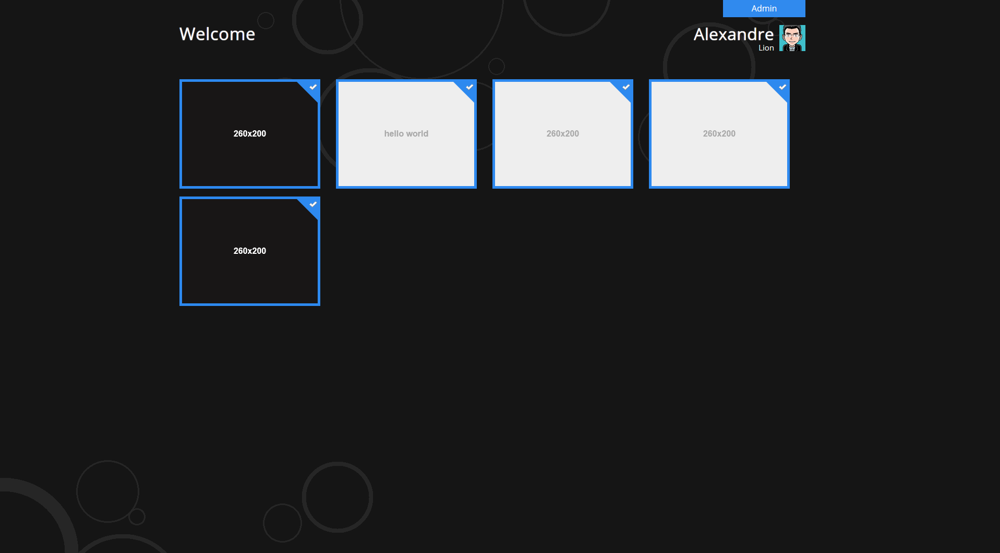

Win8Wamp
======

Win8Wamp is a `WAMPSERVER` home page based on windows8 design concept

Screenshot
-------------

<<<<<<< HEAD

=======

>>>>>>> origin/master

Installation
-------------

It's very easy to install Win8Wamp, just put you zip(in the `compressed` folder) content in your `wwww`.
Then , open the `index.php` file with your texteditor, and edit the variables in the start of the file.

Screenshots
-------------

If you want to view a project screenshot, just put a `screenshot.png` image inside your project folder.
The size of the screenshot image is `260x200`

Favicons
-------------

The same thing as the screenshots, jus put a `favicon.png` or `favicon.ico` image in your project folder.

User avatar
-------------

Just put your email address, It will take the Libravatar's picture. If you haven't one, it will take Gravatar's picture.

Enjoy
-------------

All what you have to do now, is to enjoy with your new wamp home page.

Credits
-------

Win8Wamp is a project by Omar BERRAYTI
